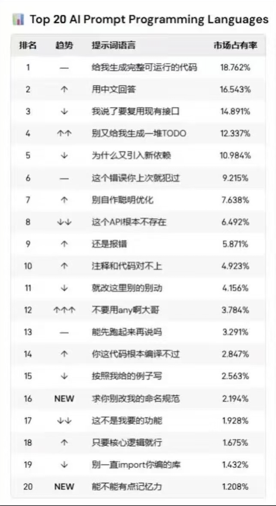

# Deepdive

[中文](./README.md) | **English**

> A slash command that makes Claude Code actually think
> (instead of just looking like it's thinking)

**A Slash Command Fix 👇**



## Quick Start

```bash
# Clone into your commands directory
cd ~/.claude/commands
git clone https://github.com/wanpengxie/deepdive.git

# Use it
/deepdive your complex question
```

## The Problem

Ever feel like Claude Code has become frustratingly... shallow?

**It's not that Claude got dumber.**
It's that the response pattern changed.

Typical scenario:
```
You: We need to design a recommendation system

Claude Code: Great! Here's the architecture:
1. Data Collection Layer (user behavior tracking)
2. Recommendation Algorithm (collaborative filtering + content similarity)
3. Tech Stack (Python + Spark + Redis + Elasticsearch)
...
```

Looks professional? **But what if your project only has 100 users?**

Claude didn't ask:
- What's the business goal?
- How many users? How much content?
- Do you have historical data?

It's **performing an answer**, not **actually thinking**.

This is the "QA mode" trap:
- Accepts the question framework (doesn't challenge assumptions)
- Converges too early (to look professional)
- Gets misled by the query (doesn't explore the essence)

## What Deepdive Does

It changes Claude's **thinking mode**, not its features.

```bash
/deepdive How should we design a recommendation system?
```

Claude will now:

**Step Zero: Understand the Question**
```
Wait, before jumping to solutions...

Confusion:
- What's the business goal of "recommendations"?
- How many users? How much content?
- Is there historical data?
```

**Exploration A: Understanding from Business Stage**
```
If it's MVP stage with <1000 users:
  → Editorial curation might be enough
  → Introducing ML too early is overengineering
```

**Exploration B: Understanding from User Behavior**
```
If users mostly search actively → Optimize search > recommendations
If users mostly browse passively → Recommendations are core
```

**Counter-example Verification**
```
- Using Spark but data is small → Overkill
- Over-personalization → Filter bubble
- No cold-start strategy → Can't recommend for new users/content
```

**Honest Conclusion**
```
Completion: 50%

Need to clarify 3 questions first: ...

Phased approach:
- V1 (MVP): Editorial picks + trending list
- V2 (Growth): Simple rules
- V3 (Mature): Collaborative filtering

To be resolved: Cold-start strategy, diversity control...
```

See the difference? The second approach **understands the problem** rather than **quickly answering**.

## Why This Works

Two simple but powerful ideas:

### 1. Repurposing TODO Tools for Thinking

**Traditional TODO** (task list):
```
- [ ] Implement recommendation algorithm
- [ ] Connect to database
```

**Deep-iterate TODO** (thinking steps):
```
- [ ] Confusion: What does "recommendation" really mean?
- [ ] Explore A: Understanding from user scenarios
- [ ] Explore B: Understanding from product goals
- [ ] Counter-example: What if we don't do this?
```

**Why it works:**
- Forces step-by-step thinking (can't write everything at once)
- Leverages Claude Code's built-in multi-step reasoning capability

### 2. Non-linear Thinking

Real thinking isn't:
```
Step 1 → Step 2 → Step 3 → Perfect conclusion ✓
```

It's:
```
Try 1 → Found problem → Overthrow
   ↓
Try 2 → New confusion → Adjust direction
   ↓
Try 3 → Verify → Partial success (acknowledge)
```

Deep-iterate allows confusion, overthrow, and imperfection.

**Because real creative thinking is messy.**

## When to Use

### Good for:
- ✅ Architecture design (no standard answer)
- ✅ Technology selection (needs trade-offs)
- ✅ Product direction (needs to understand essence)
- ✅ Deep analysis
- ✅ Ongoing problem discussion

### Not for:
- ❌ Direct technical execution (bug fixes, MVP implementation)
- ❌ Pure information queries (no design decisions needed)

## How It Works

Simplified process:

1. **Understand the question** (challenge assumptions)
2. **Build exploratory TODOs** (minimum 5, including confusion/exploration/verification)
3. **Real iteration** (allow overthrow, minimum 3 rounds)
4. **Case verification** (find holes)
5. **Honest summary** (admit uncertainty)

For detailed flow, see [commands/deepdive.md](commands/deepdive.md)

## Why "Deepdive"?

The name reflects the core principle:

- **Deep**: Not surface-level responses, but deep understanding of essence
- **Iterate**: Not one-shot answers, but genuine exploration through multiple rounds

It's about making AI think like humans actually think - messy, iterative, and honest.

## Contributing

Issues and PRs are welcome.

This is an experimental framework, far from perfect.

## License

MIT

---

> **Author**: wanpeng.xie@gmail.com
>
> Created using `/deepdive`
>
> _Understand the problem → Real exploration → Deep essence → Honest summary_
>
> _Real thinking, not performative iteration._
